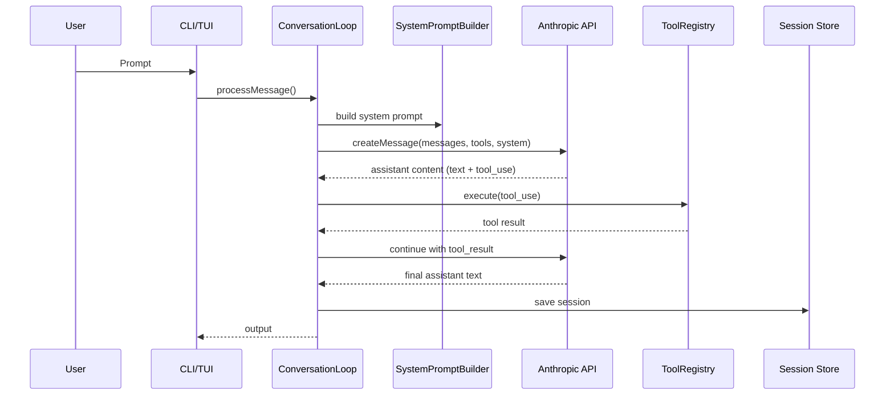
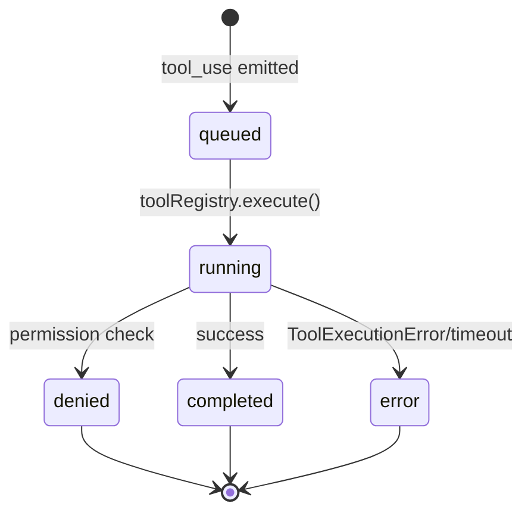
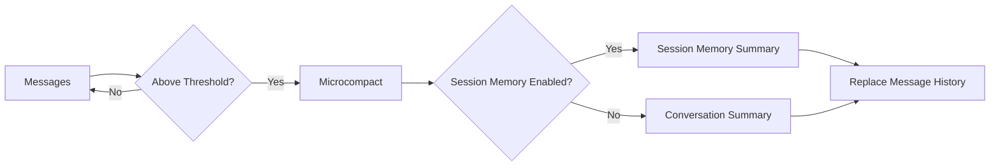
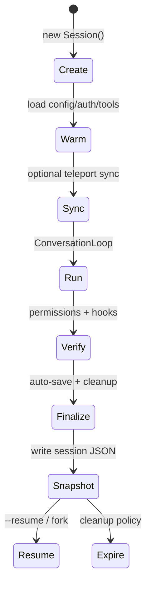
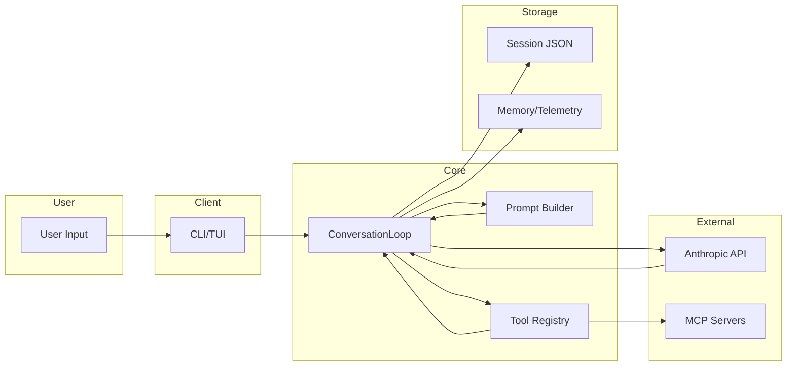

# Claude Code Open Architecture - Onboarding Doc

## TL;DR
Claude Code Open is a TypeScript reimplementation of the Claude Code CLI that runs locally and orchestrates a tool-using LLM loop around a persistent session model. The CLI builds a large system prompt, streams tool calls from Anthropic's API, executes tools with permissions + sandboxing, and persists sessions, summaries, and telemetry on disk. It also ships a UI (Ink/TUI), sub-agents, MCP integration, and a growing sandbox/permissions framework for safe automation.

## System Map
```mermaid
flowchart LR
  subgraph Client
    CLI[CLI Entry (Commander)]
    TUI[Ink UI]
    Text[Text/Print Mode]
  end

  subgraph Core
    Loop[ConversationLoop]
    Session[Session State + Messages]
    Prompt[SystemPromptBuilder]
    Tools[ToolRegistry]
    Permissions[Permission Manager]
    Hooks[Hook Runner]
  end

  subgraph Storage
    Sessions[(~/.claude/sessions/*.json)]
    Summaries[(~/.claude/sessions/summaries)]
    Memory[(~/.claude/memory + ./.claude/memory)]
    Telemetry[(~/.claude/telemetry)]
    ToolOutputs[(~/.claude/tasks)]
  end

  subgraph External
    Anthropic[Anthropic Messages API]
    OAuth[OAuth Endpoints]
    MCP[MCP Servers]
    Web[WebFetch/WebSearch]
  end

  CLI --> Loop
  TUI --> Loop
  Text --> Loop
  Loop --> Prompt
  Loop --> Session
  Loop --> Tools
  Tools --> Permissions
  Tools --> Hooks
  Tools --> MCP
  Loop --> Anthropic
  Loop --> OAuth
  Session --> Sessions
  Session --> Summaries
  Session --> Memory
  Loop --> Telemetry
  Tools --> ToolOutputs
  Tools --> Web
```

Key files:
- CLI entry + options: `claude-code-open/src/cli.ts`
- Orchestration loop: `claude-code-open/src/core/loop.ts`
- Session state + persistence: `claude-code-open/src/core/session.ts`
- System prompt builder: `claude-code-open/src/prompt/builder.ts`
- Tool registry: `claude-code-open/src/tools/base.ts`

## Execution Environment
- Local Node.js process, TypeScript source compiled to `dist/` (see `claude-code-open/package.json`).
- Tool execution is local, with optional sandboxing:
  - Linux: Bubblewrap (`claude-code-open/src/tools/sandbox.ts`, `claude-code-open/src/sandbox/bubblewrap.ts`).
  - macOS: Seatbelt (`claude-code-open/src/tools/sandbox.ts`, `claude-code-open/src/sandbox/seatbelt.ts`).
  - Windows: no sandbox (falls back to native execution).
- Sandbox policies can constrain filesystem and network access (`claude-code-open/src/sandbox/filesystem.ts`, `claude-code-open/src/sandbox/network.ts`).
- Large tool outputs are persisted to disk and truncated in-chat (`claude-code-open/src/tools/output-persistence.ts`).
- Background tasks and sub-agents run in-process and are tracked with IDs (`claude-code-open/src/core/backgroundTasks.ts`, `claude-code-open/src/tools/agent.ts`).
- Remote sessions (Teleport) use WebSocket connections for sync (`claude-code-open/src/teleport/session.ts`).

## Core Data Model
Primary entities are sessions and messages. Messages consist of content blocks (text, tool_use, tool_result, image, document). Sessions are persisted as JSON on disk, and metadata tracks fork/merge state.

Key files:
- Message + content blocks: `claude-code-open/src/types/messages.ts`
- Session state class: `claude-code-open/src/core/session.ts`
- Session persistence + metadata: `claude-code-open/src/session/index.ts`

```mermaid
erDiagram
  SESSION ||--o{ MESSAGE : contains
  SESSION {
    string sessionId
    string cwd
    number startTime
    number totalCostUSD
    map modelUsage
  }

  MESSAGE ||--o{ CONTENT_BLOCK : has
  MESSAGE {
    string role
    string|ContentBlock[] content
  }

  CONTENT_BLOCK {
    string type
  }

  CONTENT_BLOCK ||--|{ TOOL_USE : may_be
  CONTENT_BLOCK ||--|{ TOOL_RESULT : may_be
  CONTENT_BLOCK ||--|{ TEXT : may_be
  CONTENT_BLOCK ||--|{ IMAGE : may_be
  CONTENT_BLOCK ||--|{ DOCUMENT : may_be

  TOOL_USE {
    string id
    string name
    json input
  }

  TOOL_RESULT {
    string tool_use_id
    string|ContentBlock[] content
    boolean is_error
  }
```

## Message Lifecycle
1. CLI/TUI receives input and appends a `user` message to the session (`claude-code-open/src/core/loop.ts`).
2. System prompt is built (templates + attachments + environment info) (`claude-code-open/src/prompt/builder.ts`).
3. LLM call is sent via Anthropic SDK (`claude-code-open/src/core/client.ts`).
4. The assistant reply may include `tool_use` blocks (`claude-code-open/src/types/messages.ts`).
5. Each tool call runs via the `ToolRegistry` with permission checks (`claude-code-open/src/tools/base.ts`, `claude-code-open/src/permissions/index.ts`).
6. Tool outputs are formatted and injected as `tool_result` user messages (`claude-code-open/src/core/loop.ts`).
7. When no more tools are requested, the loop ends and the session auto-saves (`claude-code-open/src/core/session.ts`).

## Sequence: User -> Tool -> Response


## Tool System

### Tool Call Mapping
- Tool interfaces live in `claude-code-open/src/types/tools.ts` and are exposed to the model via `ToolDefinition`.
- The LLM emits `tool_use` blocks. The loop executes each tool and writes `tool_result` blocks back into the message stream (`claude-code-open/src/core/loop.ts`).
- Tools can request permission before execution (`BaseTool.checkPermissions`) and can be gated by global permission rules (`claude-code-open/src/permissions/index.ts`).
- In streaming mode, tool calls are tracked as `tool_use_start` / `tool_use_delta` / `tool_end` events (`claude-code-open/src/core/client.ts`, `claude-code-open/src/core/loop.ts`).



### How to Build a New Tool
1. Define input/output types in `claude-code-open/src/types/tools.ts` (optional but recommended).
2. Create a tool class extending `BaseTool` (`claude-code-open/src/tools/base.ts`).
3. Implement `getInputSchema()` and `execute()`; optionally override `checkPermissions()`.
4. Register the tool in `registerAllTools()` (`claude-code-open/src/tools/index.ts`).
5. If needed, add UI renderers for tool call output (`claude-code-open/src/ui/components/ToolCall.tsx`).

Example:
```ts
// claude-code-open/src/tools/foo.ts
import { BaseTool } from './base.js';
import type { ToolDefinition, ToolResult } from '../types/index.js';

export interface FooInput { value: string; }

export class FooTool extends BaseTool<FooInput> {
  name = 'Foo';
  description = 'Example tool that echoes a value.';

  getInputSchema(): ToolDefinition['inputSchema'] {
    return {
      type: 'object',
      properties: { value: { type: 'string' } },
      required: ['value'],
    };
  }

  async execute(input: FooInput): Promise<ToolResult> {
    return this.success(`Echo: ${input.value}`);
  }
}
```

## Model Selection & System Prompting
- CLI flags (`--model`, `--fallback-model`, `--max-tokens`) are parsed in `claude-code-open/src/cli.ts`.
- `modelConfig` resolves aliases and provides context windows + pricing (`claude-code-open/src/models/config.ts`).
- Fallback behavior and quota tracking live in `claude-code-open/src/models/fallback.ts` and `claude-code-open/src/models/quota.ts`.
- Extended Thinking is supported and passed through to API calls (`claude-code-open/src/models/thinking.ts`, `claude-code-open/src/core/loop.ts`).
- The system prompt is modular: identity, tool guidelines, permissions, environment info, and attachments (`claude-code-open/src/prompt/builder.ts`, `claude-code-open/src/prompt/templates.ts`).
- OAuth requests require a specific identity string in the first system block (`claude-code-open/src/core/client.ts`).

## Context Window Management
- Token estimation is heuristic and content-aware (`claude-code-open/src/context/index.ts`).
- Input/output budgets are computed per model (`claude-code-open/src/context/window.ts`).
- A reserved output budget is enforced and auto-compact thresholds are derived in the loop (`claude-code-open/src/core/loop.ts`).
- Persistent tool outputs are truncated to avoid context blow-ups (`claude-code-open/src/tools/output-persistence.ts`).

## Compaction
Claude Code Open implements a three-layer compaction pipeline:

1. **Microcompact (Layer 1)**
   - Clears persisted output blocks from older tool results when tokens exceed thresholds (`claude-code-open/src/core/loop.ts`).
2. **Conversation Summary (Layer 2)**
   - Generates a summary via the model and replaces the historical message list with a boundary marker + summary (`claude-code-open/src/core/loop.ts`).
3. **Session Memory (Layer 3)**
   - Creates structured session memory using a template and stores a boundary UUID for incremental compaction (`claude-code-open/src/core/loop.ts`).



## Sessions & Threading
- `Session` stores in-memory messages, usage, git info, and permission state (`claude-code-open/src/core/session.ts`).
- Sessions are persisted to JSON with metadata and versioning (`claude-code-open/src/core/session.ts`).
- Session management supports list, load, fork, merge, stats (`claude-code-open/src/session/index.ts`).
- Resume uses stored summaries to continue when context is exhausted (`claude-code-open/src/session/resume.ts`).
- Memory is stored globally and per-project to influence prompts (`claude-code-open/src/memory/index.ts`).
- Sub-agents run as background tasks and can inherit context (`claude-code-open/src/tools/agent.ts`).

## Session Lifecycle
The CLI follows a predictable lifecycle, even though not all stages are explicitly named in code.



Lifecycle touchpoints:
- Create + Warm: `claude-code-open/src/cli.ts`, `claude-code-open/src/config/index.ts`, `claude-code-open/src/auth/index.ts`
- Run: `claude-code-open/src/core/loop.ts`
- Verify: `claude-code-open/src/permissions/index.ts`, `claude-code-open/src/hooks/index.ts`
- Snapshot: `claude-code-open/src/core/session.ts`, `claude-code-open/src/session/index.ts`
- Expire: `claude-code-open/src/session/cleanup.ts`

## Collaboration / Multiplayer
- Teleport provides remote session sync via WebSocket (`claude-code-open/src/teleport/session.ts`).
- Repository validation helps prevent mismatched working directories (`claude-code-open/src/teleport/validation.ts`).
- There is no explicit conflict-resolution or multi-user locking; the model assumes a single active writer.

## Clients & Surfaces
- **CLI**: Commander-based entrypoint (`claude-code-open/src/cli.ts`).
- **TUI**: Ink/React app (`claude-code-open/src/ui/App.tsx`) with streaming tool calls.
- **Text/Print Mode**: `--print` and `--output-format` for scripted usage (`claude-code-open/src/cli.ts`).
- **IDE integration**: auto-connect hooks (`claude-code-open/src/ide/index.ts`).
- **Chrome integration**: MCP tooling (`claude-code-open/src/chrome-mcp/index.ts`).
- **Web utilities**: `WebFetch`/`WebSearch` tools (`claude-code-open/src/tools/web.ts`).

## AuthN/AuthZ + Git/PR Flow
- **AuthN**: API keys or OAuth device/code flow, stored encrypted in `~/.claude` (`claude-code-open/src/auth/index.ts`).
- **AuthZ**: Permission manager enforces allow/deny/ask rules and can audit decisions (`claude-code-open/src/permissions/index.ts`).
- **Git**: Git status and branch info enrich session metadata (`claude-code-open/src/git/index.ts`, `claude-code-open/src/core/session.ts`).
- **PR Flow**: No direct PR automation; attribution fields exist in config but PR creation is not implemented (`claude-code-open/src/config/index.ts`).

## Failure Modes & Error Handling
- API errors and overload are retried with backoff; fallback models are supported (`claude-code-open/src/core/client.ts`, `claude-code-open/src/models/fallback.ts`).
- Tool execution wraps errors and timeouts as `ToolExecutionError` (`claude-code-open/src/tools/base.ts`).
- Permission denials short-circuit tool execution and return tool errors (`claude-code-open/src/permissions/index.ts`).
- Compaction failures are non-fatal and log warnings (`claude-code-open/src/core/loop.ts`).
- Session load failures are handled gracefully with warnings (`claude-code-open/src/core/session.ts`).

## Swimlane: End-to-End Request


## Observability & Metrics
- Telemetry captures usage stats, performance, errors (local only by default) (`claude-code-open/src/telemetry/index.ts`).
- Lifecycle events are emitted for CLI and action stages (`claude-code-open/src/lifecycle/index.ts`).
- Debug categories are enabled via `CLAUDE_DEBUG` and related flags (`claude-code-open/src/cli.ts`).

## Cost & Performance Tradeoffs
- Pricing is modeled per model and accrued per session (`claude-code-open/src/models/config.ts`, `claude-code-open/src/core/session.ts`).
- Output persistence trades fidelity for context budget (`claude-code-open/src/tools/output-persistence.ts`).
- Auto-compact reduces token pressure but may hide detailed tool output (`claude-code-open/src/core/loop.ts`).
- WebSearch/WebFetch include LRU caches to reduce repeated network work (`claude-code-open/src/tools/web.ts`).
- `--solo` disables background concurrency for determinism (`claude-code-open/src/cli.ts`).

## Key Files to Read First
- `claude-code-open/src/cli.ts` — CLI flags, mode selection, startup flow.
- `claude-code-open/src/core/loop.ts` — primary orchestration loop + tool execution + compaction.
- `claude-code-open/src/core/session.ts` — in-memory session state + persistence.
- `claude-code-open/src/session/index.ts` — session list/load/fork/merge + metadata.
- `claude-code-open/src/tools/base.ts` — tool base class + registry + permission hooks.
- `claude-code-open/src/tools/index.ts` — tool registration and built-in tool set.
- `claude-code-open/src/prompt/builder.ts` — system prompt assembly and caching.
- `claude-code-open/src/models/config.ts` — model registry, context window, pricing.
- `claude-code-open/src/context/index.ts` — token estimation + compression logic.
- `claude-code-open/src/permissions/index.ts` — permission modes and audit logging.
- `claude-code-open/src/auth/index.ts` — OAuth + API key management.
- `claude-code-open/src/telemetry/index.ts` — metrics + local analytics.
- `claude-code-open/src/ui/App.tsx` — Ink-based TUI rendering.

## Quick "What Lives Where"
- `claude-code-open/src/core/` — LLM client, loop, session state, retry logic.
- `claude-code-open/src/tools/` — tool implementations and registry.
- `claude-code-open/src/context/` — context window, token estimation, summaries.
- `claude-code-open/src/prompt/` — system prompt templates and assembly.
- `claude-code-open/src/session/` — persistence, listing, resume, cleanup.
- `claude-code-open/src/auth/` — OAuth and API key flows.
- `claude-code-open/src/permissions/` — permission rules, audit logs, UI hooks.
- `claude-code-open/src/ui/` — Ink/React UI and components.
- `claude-code-open/src/mcp/` — MCP client + registry.
- `claude-code-open/src/telemetry/` — telemetry events + metrics.
- `claude-code-open/src/sandbox/` — filesystem/network/process sandboxing.
- `claude-code-open/src/agents/` — specialized agent prompts and helpers.

## Mental Model Cheat-Sheet
- Session = ordered list of messages + usage stats + metadata.
- Loop = build system prompt -> call model -> run tools -> append tool results -> repeat.
- Tools are normal classes with input schemas; the model only sees tool definitions.
- Permissions gate tool execution and can remember allow/deny rules.
- Context pressure triggers auto-compaction (microcompact -> summary -> session memory).
- UI is just a surface; the engine works the same in print mode.
- Storage is local by default: sessions, memory, telemetry, and tool outputs.
