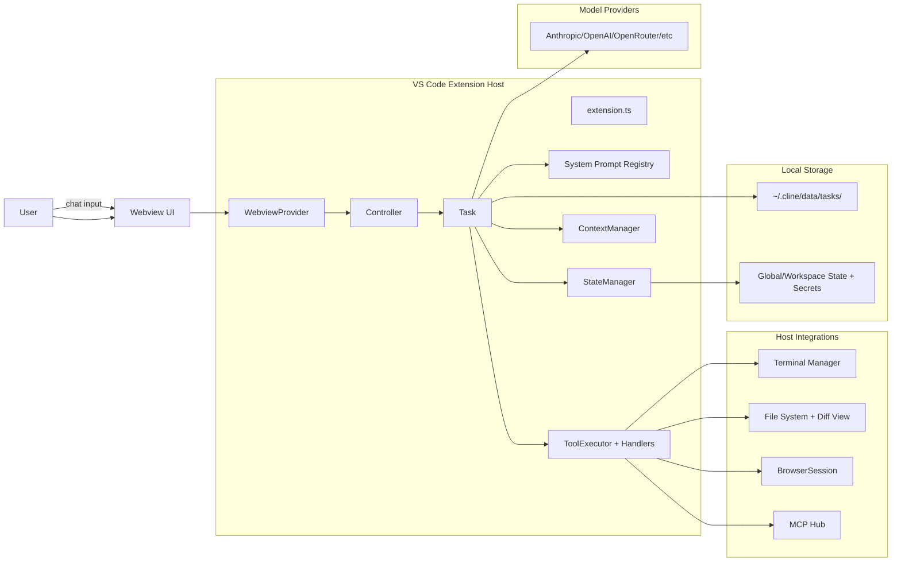
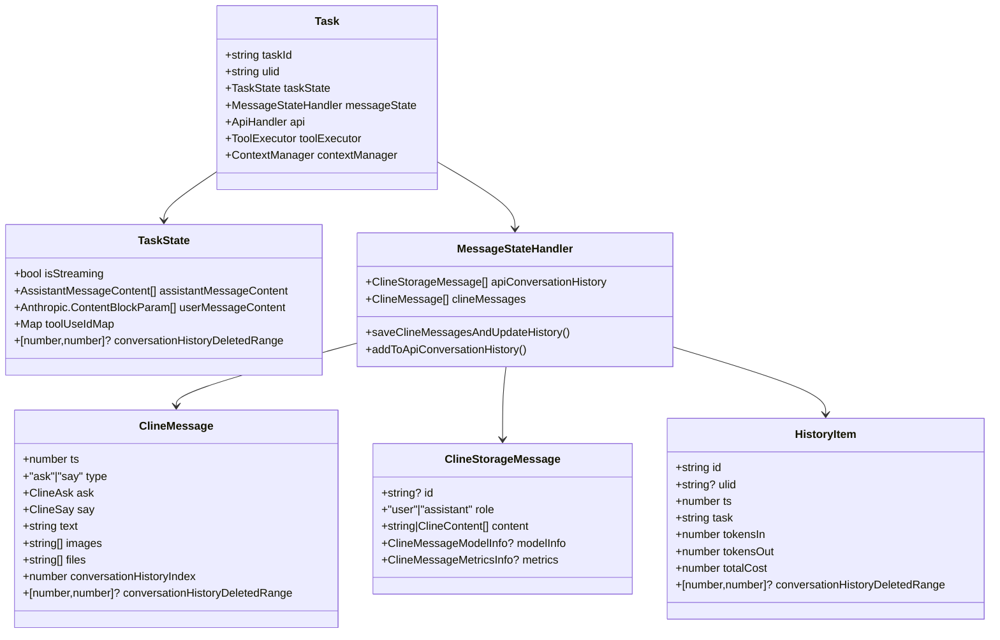
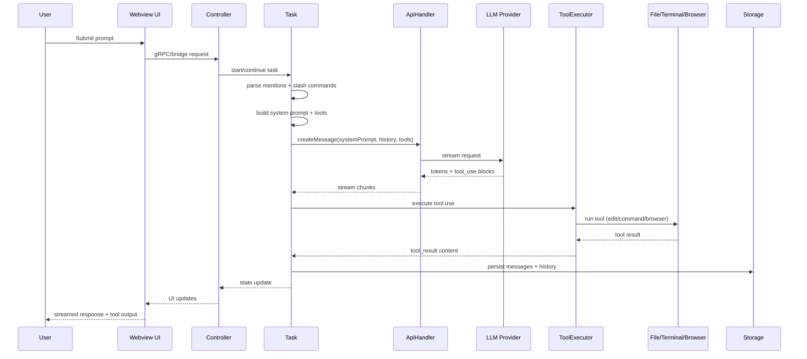
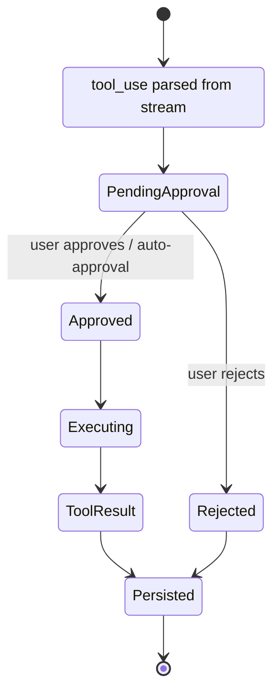
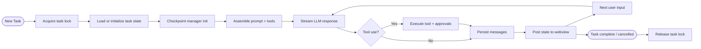
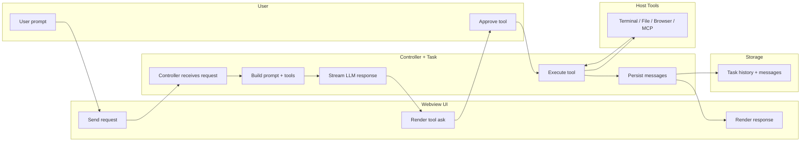

# Cline Architecture - Onboarding Doc

## TL;DR
Cline is a VS Code extension that connects a React webview UI to a controller-driven task loop. The task loop builds model-specific system prompts, streams LLM responses, executes tools (terminal/file/browser/MCP) with human approval, and persists each task to disk with checkpoints. The architecture centers on a single Task per session, a MessageStateHandler for persistence, and a ToolExecutor that enforces permissions and manages tool lifecycles.

## System Map

## Execution Environment
- Cline runs inside the VS Code extension host process (`src/extension.ts`) and renders a React UI in a webview (`src/core/webview/WebviewProvider.ts`, `webview-ui/`).
- Tools execute on the user's machine with explicit approval: terminal commands are routed through a terminal manager (`src/hosts/vscode/terminal/VscodeTerminalManager.ts`) and guarded by a command permission controller (`src/core/permissions/CommandPermissionController.ts`).
- Browser automation uses Puppeteer to connect to a local or remote Chrome instance (`src/services/browser/BrowserSession.ts`), with automatic fallback from remote to local.
- File edits and diffs flow through VS Code integrations (`src/integrations/editor/DiffViewProvider.ts`, `src/integrations/editor/FileEditProvider.ts`).
- Task checkpoints are local snapshots using a checkpoint manager that can be single-root or multi-root depending on workspace (`src/integrations/checkpoints/factory.ts`).
- MCP servers are external processes or HTTP endpoints managed by the MCP hub (`src/services/mcp/McpHub.ts`).

## Core Data Model
Cline models two distinct message streams: UI-facing messages for the webview, and provider-facing messages for the LLM. Task history ties them together with indices and compaction metadata.

Key schemas and storage keys live in:
- `src/shared/ExtensionMessage.ts` (UI message types and enums)
- `src/shared/messages/content.ts` (storage message format)
- `src/shared/storage/state-keys.ts` (global + workspace + secret keys)
- `src/core/storage/disk.ts` (file layout and persistence helpers)

## Message Lifecycle
1. **User input** arrives from the webview UI into the extension controller (`src/core/webview/WebviewProvider.ts`, `src/core/controller/index.ts`).
2. **Controller** creates or resumes a `Task` and initializes state, checkpointing, and workspace context (`src/core/task/index.ts`).
3. **Mentions + slash commands** are expanded into structured context (`src/core/mentions/index.ts`, `src/core/slash-commands/index.ts`).
4. **System prompt** is assembled based on model family, settings, rules, and tools (`src/core/prompts/system-prompt/registry/PromptRegistry.ts`).
5. **Context management** prepares the truncated conversation history and compaction metadata (`src/core/context/context-management/ContextManager.ts`).
6. **API request** streams via the selected provider handler (`src/core/api/index.ts`).
7. **Streaming handler** parses tool calls and reasoning chunks (`src/core/task/StreamResponseHandler.ts`).
8. **ToolExecutor** validates, approves, and executes tool handlers; results are appended to user message content (`src/core/task/ToolExecutor.ts`).
9. **MessageStateHandler** persists both UI messages and provider history to disk (`src/core/task/message-state.ts`).
10. **UI updates** are pushed to the webview with new messages and status (`src/core/controller/ui/*`).

## Sequence: User -> Tool -> Response

## Tool System

### Tool Call Mapping
- Tool IDs are centralized in `src/shared/tools.ts` (`ClineDefaultTool` and `READ_ONLY_TOOLS`).
- Prompt-facing tool specs are defined in `src/core/prompts/system-prompt/tools/*.ts` and registered via `src/core/prompts/system-prompt/tools/init.ts`.
- Native tool calling is generated per provider via `ClineToolSet` and `spec.ts` converters (`src/core/prompts/system-prompt/registry/ClineToolSet.ts`, `src/core/prompts/system-prompt/spec.ts`).
- Tool execution is coordinated by `ToolExecutor` and `ToolExecutorCoordinator` with validation and approval gates (`src/core/task/ToolExecutor.ts`, `src/core/task/tools/ToolExecutorCoordinator.ts`).
- Each tool handler lives in `src/core/task/tools/handlers/` and implements `IToolHandler` or `IFullyManagedTool`.
- Tool results are normalized and appended to the LLM message stream via `ToolResultUtils` (`src/core/task/tools/utils/ToolResultUtils.ts`).

### Tool Lifecycle (State Diagram)

Notes:
- Partial tool blocks are streamed to the UI via `StreamResponseHandler.getPartialToolUsesAsContent()` before execution.
- `ToolValidator` enforces `.clineignore` and workspace boundaries (`src/core/task/tools/ToolValidator.ts`).
- Pre/Post tool hooks can modify or cancel execution (`src/core/hooks/hook-executor.ts`).

### How to Build a New Tool
1. **Define the tool ID** in `src/shared/tools.ts` (add to `ClineDefaultTool`, update `READ_ONLY_TOOLS` if needed).
2. **Add prompt spec** in `src/core/prompts/system-prompt/tools/<tool>.ts` and export variants; register it in `src/core/prompts/system-prompt/tools/init.ts`.
3. **Implement handler** in `src/core/task/tools/handlers/<ToolName>Handler.ts` (implements `IToolHandler` or `IFullyManagedTool`).
4. **Register handler** in `ToolExecutor.registerToolHandlers()` (`src/core/task/ToolExecutor.ts`).
5. **Update UI message schemas** if a new tool-specific UI payload is needed (`src/shared/ExtensionMessage.ts`).
6. **Add display/validation helpers** if required (`src/core/task/tools/utils/ToolDisplayUtils.ts`, `src/core/task/tools/ToolValidator.ts`).

## Model Selection & System Prompting
- Provider selection is driven by `ApiConfiguration` from `StateManager` and the current mode (plan/act). The factory lives in `src/core/api/index.ts` (`buildApiHandler`).
- Each provider has a dedicated handler under `src/core/api/providers/` implementing `ApiHandler`.
- Model metadata and pricing are defined in `src/shared/api.ts` and stored with each message (`src/shared/messages/metrics.ts`).
- System prompts are composed by `PromptRegistry` + `PromptBuilder` using model variants and components (`src/core/prompts/system-prompt/registry/PromptRegistry.ts`, `src/core/prompts/system-prompt/README.md`).
- `SystemPromptContext` aggregates IDE info, rules, MCP servers, skills, and settings in `Task` before requesting a prompt (`src/core/task/index.ts`).
- Native tool calling is enabled per model variant using `ClineToolSet.getNativeTools()` and converted to provider-specific formats in `spec.ts`.

## Context Window Management
- Context size is computed per model using `getContextWindowInfo()` (`src/core/context/context-management/context-window-utils.ts`).
- `ContextManager` maintains `contextHistoryUpdates` to track edits applied to prior messages and safely truncate history (`src/core/context/context-management/ContextManager.ts`).
- File-read optimization replaces repeated file contents with truncation notices to save tokens (`ContextManager.applyContextOptimizations`).
- Truncation metadata is stored in `conversationHistoryDeletedRange` and persisted alongside task history (`src/core/task/message-state.ts`).
- When context window errors occur, `context-error-handling.ts` detects provider-specific failures and triggers retries or compaction.

## Compaction
- Manual compaction is triggered by the `condense` tool (`src/core/task/tools/handlers/CondenseHandler.ts`) and slash commands `/smol` or `/compact` (`src/core/prompts/commands.ts`).
- Automatic compaction uses the `summarize_task` tool and the `summarizeTask` prompt (`src/core/prompts/contextManagement.ts`, `src/core/task/tools/handlers/SummarizeTaskHandler.ts`).
- Pre-compact hooks run before compaction and can cancel or modify context (`src/core/hooks/precompact-executor.ts`).
- The continuation prompt rehydrates a summarized session when a new turn resumes (`continuationPrompt` in `src/core/prompts/contextManagement.ts`).

## Sessions & Threading
- A **Task** is the session boundary (taskId + ulid) and lives in `src/core/task/index.ts`.
- Task history is persisted as:
  - `~/.cline/data/tasks/<taskId>/api_conversation_history.json`
  - `~/.cline/data/tasks/<taskId>/ui_messages.json`
  - `~/.cline/data/tasks/<taskId>/context_history.json`
- Global history is stored in `StateManager` as `HistoryItem[]` (`src/shared/HistoryItem.ts`, `src/core/storage/StateManager.ts`).
- Task locks prevent concurrent access to the same task folder (`src/core/task/TaskLockUtils.ts`).

## Session Lifecycle

## Collaboration / Multiplayer
- Cline is currently single-user per task. There is no multi-user session model, shared editing, or concurrent message attribution in the core runtime.
- The architecture does include watchers for external state changes (e.g., task history edits) via `StateManager` callbacks, but this is for local sync rather than real-time collaboration.

## Clients & Surfaces
- **VS Code Webview UI:** `webview-ui/` (React UI bundled into the extension and loaded by `WebviewProvider`).
- **Extension Host:** `src/extension.ts` registers commands, webview provider, and host integrations.
- **Host Abstraction:** `src/hosts/host-provider.ts` allows platform-specific implementations (VS Code vs standalone/other hosts).
- **CLI Subagents:** `/subagent` command triggers a `cline` CLI invocation when enabled (`src/core/prompts/commands.ts`).
- **Browser Surface:** `BrowserSession` drives headless/local Chrome sessions for web tasks (`src/services/browser/BrowserSession.ts`).

## AuthN/AuthZ + Git/PR Flow
- Auth is optional and primarily used for Cline-managed services (web search, account features). See `src/services/auth/AuthService.ts` and related providers.
- API keys and provider settings are stored via `StateManager` + secret storage (`src/shared/storage/state-keys.ts`, `src/core/storage/StateManager.ts`).
- Git is used for checkpoints and diff views (not for PR automation): `src/integrations/checkpoints/*`, `src/hosts/vscode/commit-message-generator.ts`.
- There is no built-in PR creation flow in core; Cline operates on the local workspace and surfaces diffs for user review.

## Failure Modes & Error Handling
- **Context window overflow:** detected in `context-error-handling.ts` and triggers auto-retry or summarization in `Task`.
- **Provider errors:** `ErrorService` maps provider failures and emits UI prompts for retry (`src/services/error/*`, `src/core/task/index.ts`).
- **Tool failures:** `ToolExecutor.handleError()` posts tool error responses and continues the loop.
- **Permissions denied:** `.clineignore` and command permission checks block execution (`ToolValidator`, `CommandPermissionController`).
- **Hook cancellations:** pre-tool or pre-compact hooks can cancel execution (`src/core/hooks/*`).
- **Browser failures:** remote browser failures fall back to local; errors are tracked in telemetry (`BrowserSession`).
- **Checkpoint failures:** checkpoint manager errors are surfaced in task history (`TaskState.checkpointManagerErrorMessage`).

## Swimlane: End-to-End Request

## Observability & Metrics
- Telemetry is centralized in `src/services/telemetry/TelemetryService.ts` with metrics for tokens, cost, TTFT, tool calls, errors, hooks, and checkpoints.
- Streaming API timing and throughput are captured per request; tool usage is tracked per tool call and provider.
- Logs and user-facing errors are routed through `Logger` and `HostProvider.window` (`src/services/logging/Logger.ts`, `src/hosts/host-provider.ts`).

## Cost & Performance Tradeoffs
- **Prompt size:** `ContextManager` trims history and replaces redundant file reads to stay under model limits.
- **Compaction:** `summarize_task` and `condense` reduce token usage at the cost of losing detailed conversational context.
- **Streaming:** Tool partials are displayed while streaming to improve perceived latency (`StreamResponseHandler`).
- **Parallel tools:** Enabled for GPT-5 or via settings to reduce tool round-trips (`ToolExecutor.isParallelToolCallingEnabled`).
- **Checkpointing:** Adds disk overhead and git operations but enables reversible changes and diff previews.

## Key Files to Read First
- `src/extension.ts` — extension activation and command registration.
- `src/core/webview/WebviewProvider.ts` — webview bootstrap and UI bridge.
- `src/core/controller/index.ts` — controller orchestration and state lifecycle.
- `src/core/task/index.ts` — main task loop (prompting, streaming, errors, compaction).
- `src/core/task/ToolExecutor.ts` — tool execution, approvals, error handling.
- `src/core/task/StreamResponseHandler.ts` — streaming tool use parsing.
- `src/core/context/context-management/ContextManager.ts` — context window logic.
- `src/core/prompts/system-prompt/registry/PromptRegistry.ts` — system prompt assembly.
- `src/core/storage/StateManager.ts` and `src/core/storage/disk.ts` — persistence.
- `src/services/mcp/McpHub.ts` — MCP server management.

## Quick "What Lives Where"
- `src/core/` — task loop, tools, prompt assembly, context, storage.
- `src/services/` — telemetry, auth, MCP, browser, logging.
- `src/integrations/` — terminal, editor, checkpoints, diagnostics.
- `src/hosts/` — VS Code host bridge + host abstractions.
- `src/shared/` — shared schemas, message formats, tools, settings.
- `webview-ui/` — React UI and webview assets.

## Mental Model Cheat-Sheet
- **Task = session.** A Task owns prompt building, tool execution, and persistence.
- **Two message streams.** UI messages (`ClineMessage`) vs provider messages (`ClineStorageMessage`).
- **Tools are first-class.** Specs live in system prompt; handlers live in task/tools.
- **Context is managed proactively.** ContextManager trims history and triggers compaction.
- **Everything is user-mediated.** Tool execution and risky actions require approval.
