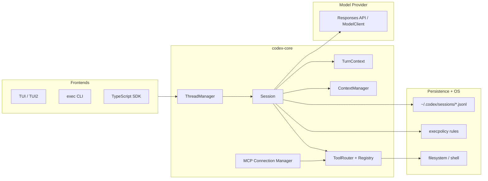
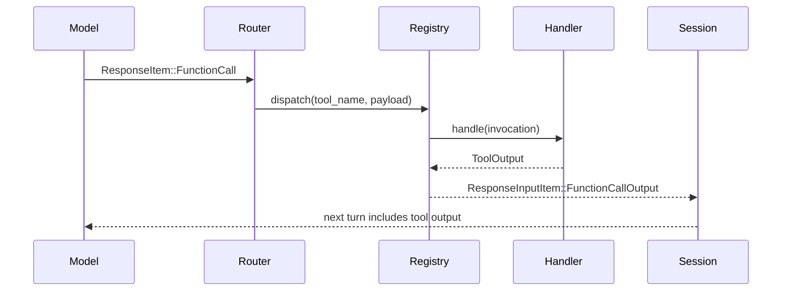
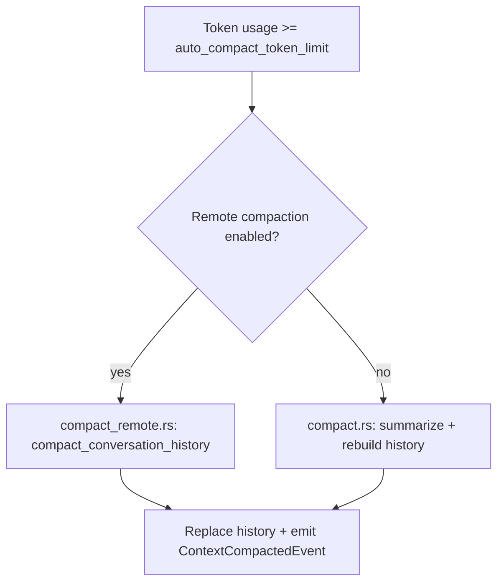

# Codex CLI (open-source) architecture breakdown

This doc is a team onboarding guide to the Codex CLI codebase (the Rust implementation inside the `codex` submodule). It focuses on the agent loop, sessions/threads, tool call mapping, model selection and prompting, context window management, compaction, plans/todos, memory/persistence, and failure modes. It also calls out the most important files to read.

Scope: this is based on the code inside `codex/` in this repo. Paths below are relative to the `codex` submodule.

---

## 1) Repo map (top-level)

At the top level of the `codex` submodule:

- `codex-rs/` - Rust workspace containing the core agent, TUI, exec CLI, protocol, tool runtimes, etc.
- `codex-cli/` - JS/TS packaging wrapper for the CLI distribution (the Rust binary is the heart).
- `sdk/` - SDKs (for example `sdk/typescript/`) for programmatic use.
- `shell-tool-mcp/` - MCP server providing a sandboxed `shell` tool.
- `docs/` - usage, configuration, and TUI docs.

Key emphasis: `codex-rs/core/` is the business logic (the agent brain). All UIs (TUI, exec, etc.) delegate into core.

---

## 2) High-level architecture

### System overview



### The agent loop in one sentence

A thread/session receives user input, builds a prompt from in-memory history plus instructions, asks the model to act, executes tool calls if requested, records outputs back into history, and repeats until the turn ends.

---

## 3) Core concepts and data structures

### Threads, sessions, turns

- Thread: externally exposed conversation handle.
  - `codex-rs/core/src/thread_manager.rs` - creates threads and stores them in memory.
  - `codex-rs/core/src/codex_thread.rs` - lightweight handle that lets clients submit ops and receive events.

- Session: internal stateful agent runtime for a thread.
  - `codex-rs/core/src/codex.rs` (struct `Session`)
  - Owns history, features, services (MCP, exec policy, etc.), and the active turn.

- Turn: one cycle of send prompt -> model response(s) -> tools -> completion.
  - `codex-rs/core/src/codex.rs` (`run_turn`, `run_model_turn`)

### Response items (the canonical transcript)

History is recorded as `ResponseItem` values (model API shapes). This is important because tools and messages are all normalized into a single timeline.

- `codex-rs/protocol/src/models.rs` - `ResponseItem` and content structures.
- `codex-rs/core/src/context_manager/history.rs` - stores them in memory.
- `codex-rs/core/src/event_mapping.rs` - parses `ResponseItem` into `TurnItem` for UI/event rendering.

### Events + Ops (client <-> core contract)

- `codex-rs/protocol/src/protocol.rs` - defines `Op` (requests) and `Event` (responses)
  - Examples: `Op::Compact`, `Op::Undo`, `Op::ThreadRollback`, `Op::ListSkills`, `Op::RunUserShellCommand`.

---

## 4) Session lifecycle and event flow (swimlane)

```mermaid
flowchart LR
  subgraph User
    U1[User input]
  end
  subgraph UI
    UI1[CLI/TUI receives input]
    UI2[Submits Op::SubmitInput]
    UI3[Renders Event stream]
  end
  subgraph Core
    C1[ThreadManager -> Session]
    C2[run_turn builds prompt]
    C3[run_model_turn]
    C4[ToolRouter dispatch]
    C5[Record outputs in history]
  end
  subgraph Model
    M1[Model returns ResponseItem(s)]
  end
  subgraph Tools
    T1[Shell / MCP / ApplyPatch]
  end

  U1 --> UI1 --> UI2 --> C1 --> C2 --> C3 --> M1
  M1 --> C4 --> T1 --> C5 --> C3
  C3 --> UI3
```

Where to look:
- Turn loop: `codex-rs/core/src/codex.rs` (`run_turn`, `run_model_turn`)
- Event emission: `codex-rs/core/src/codex.rs` (`send_event` calls)
- Turn item parsing: `codex-rs/core/src/event_mapping.rs`

---

## 5) Model selection + prompting system

### Model selection

- `codex-rs/core/src/models_manager/manager.rs` selects a model:
  - defaults depend on auth mode (ChatGPT vs API key)
  - caches remote model metadata
- `codex-rs/core/src/models_manager/model_info.rs` defines per-model behavior:
  - base instructions for each model (`prompt.md`, `gpt_5_2_prompt.md`, etc.)
  - tool support (apply_patch tool type, shell type, parallel tools)
  - truncation policy + auto-compaction thresholds

### Prompt construction (inputs + instructions)

Prompt inputs are built from:

1) History (`ContextManager`) - user/assistant messages, tool calls/outputs
2) Base instructions - model-specific prompt text
3) Developer instructions - config overrides
4) User instructions - AGENTS.md + config + skills
5) Tools - serialized tool specs for the current turn

Important files:

- `codex-rs/core/src/client_common.rs` - `Prompt` structure; tool serialization
- `codex-rs/core/src/models_manager/model_info.rs` - base prompt text + model config
- `codex-rs/core/prompt.md` and `codex-rs/core/gpt_*.md` - instruction templates
- `codex-rs/core/src/project_doc.rs` - loads AGENTS.md from repo root -> cwd
- `codex-rs/core/src/user_instructions.rs` - wraps AGENTS/skills into special message items
- `codex-rs/core/src/custom_prompts.rs` - discovers prompts in `$CODEX_HOME/prompts`
- `codex-rs/core/src/skills/*` - skill discovery and injection

### Prompt assembly diagram

```mermaid
flowchart TB
  A[ModelInfo: base_instructions] --> P[Prompt]
  B[Developer instructions (config)] --> P
  C[User instructions: AGENTS.md + config] --> P
  D[Skills injections] --> P
  E[ContextManager history] --> P
  F[Tool specs for this turn] --> P
  P --> M[Model request]
```

Key idea: base + developer + user + skills are additive; history is normalized and truncated as needed before being sent.

---

## 6) Tool system (mapping + execution)

### Tool definition and registration

Tools are declared as JSON-schema specs and registered with handlers.

- `codex-rs/core/src/tools/spec.rs` - builds tool specs (shell, apply_patch, plan, MCP, etc.)
- `codex-rs/core/src/tools/registry.rs` - registers handlers and dispatches calls
- `codex-rs/core/src/tools/handlers/*` - concrete tool implementations

Key example tools:

- Shell: `tools/handlers/shell.rs`, `tools/runtimes/shell.rs`
- Apply patch: `tools/handlers/apply_patch.rs`
- Plan/todos: `tools/handlers/plan.rs`
- MCP passthrough: `tools/handlers/mcp.rs`, `mcp_connection_manager.rs`

### Tool call mapping (ResponseItem -> handler)

Model outputs produce `ResponseItem::FunctionCall`, `ResponseItem::CustomToolCall`, or `ResponseItem::LocalShellCall`. These are converted into a normalized `ToolCall` and dispatched.

- `codex-rs/core/src/tools/router.rs` - maps response items to `ToolCall`
- `codex-rs/core/src/tools/context.rs` - `ToolInvocation` (session + turn + call id)
- `codex-rs/core/src/tools/parallel.rs` - parallel tool call runtime with gating

### Tool call sequence diagram



### Adding a new built-in tool (recipe)

1) Add a ToolSpec in `tools/spec.rs` (JSON schema + description)
2) Implement a ToolHandler in `tools/handlers/` (parse args, run logic, return ToolOutput)
3) Register the handler and spec in `build_specs()` (same file)
4) Wire runtime if needed (for example shell-like tools in `tools/runtimes/`)
5) Add tests in relevant handler/spec tests

Tip: for MCP tools, you do not add code in core; they are discovered via MCP and mapped automatically in `mcp_connection_manager.rs`.

---

## 7) Context window management

Context is managed explicitly and centrally. The system tries to keep the most useful content in the model prompt while keeping tool outputs and history size bounded.

### What happens to history

- `ContextManager` stores an ordered list of `ResponseItem`s.
- It normalizes call/output pairs and removes orphans.
- It tracks token usage (approximate) and can truncate tool outputs and messages.

Important files:

- `codex-rs/core/src/context_manager/history.rs`
- `codex-rs/core/src/truncate.rs`
- `codex-rs/core/src/state/session.rs`

### Truncation policy

- `TruncationPolicy` is model-dependent (tokens or bytes)
- Tool outputs are truncated when serialized for the model
- Large tool outputs carry "truncated" markers

Key paths:

- `codex-rs/core/src/truncate.rs`
- `codex-rs/core/src/tools/mod.rs` (formatting + truncation)
- `codex-rs/core/src/models_manager/model_info.rs` (config overrides)

---

## 8) Compaction (auto + manual)

Compaction is Codex's summary-based memory reset to keep long threads usable.

### When compaction runs

- Manual: `Op::Compact` triggers a compact task.
- Auto: if `Session` token usage exceeds the model's `auto_compact_token_limit`.

Core control flow:
- `codex-rs/core/src/codex.rs` - checks token usage in `run_turn` and calls `run_auto_compact`
- `codex-rs/core/src/compact.rs` - inline compaction via prompt + summary
- `codex-rs/core/src/compact_remote.rs` - remote compaction (OpenAI provider)

### Compaction flowchart



### What gets preserved

- User messages (recent) + a summary of earlier turns
- Ghost snapshots (needed for `/undo`) are preserved

Relevant code:

- `codex-rs/core/src/compact.rs` (`build_compacted_history`)
- `codex-rs/core/src/compact_remote.rs`
- `codex-rs/core/src/tasks/compact.rs`

---

## 9) Todos / plans (structured planning)

Codex uses a simple structured tool to capture plans/todos so UIs can render them. The tool is not for the model's own memory; it is for UI-visible plan state.

- Tool spec + handler: `codex-rs/core/src/tools/handlers/plan.rs`
- Events: `codex-rs/protocol/src/plan_tool.rs` + `protocol.rs` (PlanUpdate events)

The `update_plan` tool accepts a list of steps (`pending`, `in_progress`, `completed`) and emits an event that frontends can show as a task checklist.

---

## 10) Memory and persistence

Codex has two kinds of memory:

### 1) In-memory transcript (fast, volatile)

- `ContextManager` stores the live `ResponseItem` history
- Used to build prompts every turn
- Editable via undo / rollback operations

Key files:
- `codex-rs/core/src/context_manager/history.rs`
- `codex-rs/core/src/state/session.rs`

### 2) Persistent rollouts (durable)

- Each session is persisted as JSONL under `~/.codex/sessions/`
- Enables resume, history inspection, and UI replay

Key files:
- `codex-rs/core/src/rollout/recorder.rs`
- `codex-rs/core/src/rollout/list.rs`
- `codex-rs/protocol/src/protocol.rs` (`InitialHistory`, `ResumedHistory`)

### Ghost snapshots (undo safety)

Codex snapshots the repo (ghost commits) so it can undo tool-driven file edits.

- `codex-rs/core/src/tasks/ghost_snapshot.rs`
- `codex-rs/core/src/tasks/undo.rs`

---

## 11) Failure modes and safety guardrails

This is the practical checklist to understand why a turn fails and how Codex guards the system.

### Safety / sandbox / approvals

- Exec policy plus sandbox enforcement
- Explicit approval workflows for risky commands

Key files:
- `codex-rs/core/src/exec_policy.rs`
- `codex-rs/core/src/tools/sandboxing/*`
- `codex-rs/execpolicy/` and `codex-rs/execpolicy-legacy/`
- `shell-tool-mcp/` (sandboxed shell MCP server)

### Common runtime failure cases

1) Context window exceeded
   - `codex-rs/core/src/compact.rs` trims history and retries; may emit errors if compaction cannot fit.

2) Tool failures
   - `ToolRouter` generates a failure output item instead of crashing the turn.
   - `codex-rs/core/src/tools/router.rs` (`failure_response`)

3) Invalid image payloads
   - `run_turn` sanitizes and warns if image input is invalid.
   - `codex-rs/core/src/codex.rs` (invalid image branch)

4) MCP startup or call failures
   - Managed in `mcp_connection_manager.rs`, errors surface as events
   - Tool names sanitized and truncated to avoid API constraints

5) Undo / ghost snapshot issues
   - If repo is not git or snapshot fails, undo is unavailable.
   - Warnings emitted if snapshots are slow (large untracked files).

---

## 12) Start here file list (most important)

If you read only a handful of files, read these:

- `codex-rs/core/src/codex.rs` - main agent loop, session/turn orchestration
- `codex-rs/core/src/thread_manager.rs` - thread creation + session wiring
- `codex-rs/core/src/context_manager/history.rs` - transcript + token accounting
- `codex-rs/core/src/tools/router.rs` - tool call mapping
- `codex-rs/core/src/tools/spec.rs` - tool definitions + registration
- `codex-rs/core/src/models_manager/model_info.rs` - model prompts and per-model behavior
- `codex-rs/core/src/project_doc.rs` - AGENTS.md discovery + user instructions
- `codex-rs/core/src/compact.rs` - summary-based compaction
- `codex-rs/core/src/rollout/recorder.rs` - persistent session logs
- `codex-rs/protocol/src/protocol.rs` - public ops/events contract

---

## 13) How to explain Codex architecture to a new engineer

If someone asks "how does Codex work?", this short explanation usually lands well:

Codex CLI is a Rust-first agent runtime. A thread owns a session that holds all state (history, features, tool configs). Each user input starts a turn: Codex builds a prompt from history plus instructions, sends it to a model, and either gets a message or a tool call. Tool calls are routed through a registry and executed in a sandbox; outputs are recorded back into history and fed into the next model turn. The system keeps context bounded via truncation and compaction, and it persists every session as JSONL so it can be resumed or audited.

---

## 14) Suggested onboarding exercises

If you want to onboard the team fast, try these guided walks:

1) Tool path walk
   - Follow a tool call from `ResponseItem::FunctionCall` -> `ToolRouter` -> `ToolHandler` -> output.

2) Compaction walk
   - Read `compact.rs` and `compact_remote.rs` and map to the `run_turn` loop.

3) Session persistence walk
   - Trace `RolloutRecorder` and how a session is resumed.

4) Prompt assembly walk
   - Map `ModelInfo` -> `Prompt` -> `ModelClient` -> response items.

---

If you want, I can also:
- add a Mermaid diagram customized to your team model/tool stack,
- add a short common glossary section,
- or create a "how to add a new tool in 20 minutes" tutorial.
