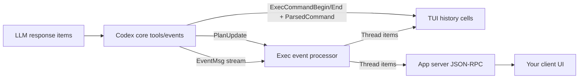

# Codex CLI Task UI and Tool Call Flow

## Scope
This document describes how the Codex CLI (codex-rs) produces the on-screen task UI
that shows:

- Tool call summaries (the "Exploring/Explored" list of Read/List/Search lines).
- The plan/todo list (checkbox list created by the update_plan tool).
- MCP tool call rows ("Calling/Called <server>.<tool>").
- The shimmer status line with elapsed time and the "esc to interrupt" hint.

It also maps the client-side TUI rendering to the server-side event and tool plumbing.
All file references are in this repository and include a line anchor for quick lookup.

## Terminology
**Client side (TUI):**
The terminal UI that renders history cells, the bottom status bar, and the
"Explored" summaries. This lives under `src/coding-agents/codex/codex-rs/tui/`.

**Server side (core/exec/protocol):**
The event-producing side that interprets tool calls, emits events, and builds
thread items for the UI to consume. This lives under:

- `src/coding-agents/codex/codex-rs/core/`
- `src/coding-agents/codex/codex-rs/exec/`
- `src/coding-agents/codex/codex-rs/protocol/`

## High-level Event Flow
1. A tool call happens (shell exec, update_plan, MCP tool).
2. codex-core emits protocol events (e.g., ExecCommandBegin/End, PlanUpdate,
   McpToolCallBegin/End).
3. The exec event processor converts protocol events into thread items.
4. The TUI consumes thread items and renders history cells + the status line.

Key event types:

- `EventMsg::PlanUpdate` in `src/coding-agents/codex/codex-rs/protocol/src/protocol.rs:755`
- `ExecCommandBegin/End` events (with parsed command metadata)
- `McpToolCallBegin/End` events

## Requested Quick Reference (verbatim mapping)
### Todo List Logic
- Tool surface + schema: `update_plan` tool definition and args parsing live in
  `src/coding-agents/codex/codex-rs/core/src/tools/handlers/plan.rs:20`, with wire types
  in `src/coding-agents/codex/codex-rs/protocol/src/plan_tool.rs:6`.
- Event emission: the handler emits `EventMsg::PlanUpdate` to the session stream in
  `src/coding-agents/codex/codex-rs/core/src/tools/handlers/plan.rs:100`.
- Event → todo list item: plan updates are converted into `TodoListItem` thread items
  in `src/coding-agents/codex/codex-rs/exec/src/event_processor_with_jsonl_output.rs:438`,
  using the `TodoItem`/`TodoListItem` structs in
  `src/coding-agents/codex/codex-rs/exec/src/exec_events.rs:233`.

### Tool Calls (“Explored” list)
- Parsing of “Read/List/Search” summaries comes from `ParsedCommand` in
  `src/coding-agents/codex/codex-rs/protocol/src/parse_command.rs:6` and the parser in
  `src/coding-agents/codex/codex-rs/core/src/parse_command.rs:30`.
- Parsed commands are attached to exec events via `ToolEmitter::shell/unified_exec` in
  `src/coding-agents/codex/codex-rs/core/src/tools/events.rs:90`.
- The “Exploring/Explored” grouping and the “Read/List/Search” rows are rendered in
  `src/coding-agents/codex/codex-rs/tui/src/exec_cell/render.rs:255`, using
  “exploring” detection from `src/coding-agents/codex/codex-rs/tui/src/exec_cell/model.rs:140`.

### MCP Tool Call Rows (“Calling/Called …”)
- MCP tool begin/end events become `McpToolCallItem` thread items in
  `src/coding-agents/codex/codex-rs/exec/src/event_processor_with_jsonl_output.rs:250`.
- The history cell that renders “Calling/Called <server.tool>” plus results is
  `McpToolCallCell` in `src/coding-agents/codex/codex-rs/tui/src/history_cell.rs:1041`.

### Shimmer Status Line (header + elapsed + interrupt)
- The shimmer text is produced by `shimmer_spans` in
  `src/coding-agents/codex/codex-rs/tui/src/shimmer.rs:21`.
- Elapsed formatting is in `fmt_elapsed_compact` in
  `src/coding-agents/codex/codex-rs/tui/src/status_indicator_widget.rs:49`, and the
  “(elapsed • esc to interrupt)” string is assembled in
  `src/coding-agents/codex/codex-rs/tui/src/status_indicator_widget.rs:219`.
- The header text (what’s shimmering) comes from the first bold segment of the
  reasoning stream in `src/coding-agents/codex/codex-rs/tui/src/chatwidget.rs:651`
  via `extract_first_bold` in `src/coding-agents/codex/codex-rs/tui/src/chatwidget.rs:4231`.

## Plan/Todo List (update_plan tool)
### Server side
- Tool definition and JSON schema for `update_plan` live in
  `src/coding-agents/codex/codex-rs/core/src/tools/handlers/plan.rs:20`.
- The handler parses arguments and emits `EventMsg::PlanUpdate`
  `src/coding-agents/codex/codex-rs/core/src/tools/handlers/plan.rs:100`.
- Plan argument types are defined in
  `src/coding-agents/codex/codex-rs/protocol/src/plan_tool.rs:6`.

### Exec-side aggregation
- `EventProcessorWithJsonOutput` converts a plan update into a `TodoListItem`
  thread item and emits `ItemStarted` or `ItemUpdated`.
  `src/coding-agents/codex/codex-rs/exec/src/event_processor_with_jsonl_output.rs:438`.
- The `TodoItem`/`TodoListItem` structs are in
  `src/coding-agents/codex/codex-rs/exec/src/exec_events.rs:233`.

### Client side (TUI)
- The checkbox-style list is rendered by `PlanUpdateCell` in
  `src/coding-agents/codex/codex-rs/tui/src/history_cell.rs:1506`.

## Tool Call Summaries ("Exploring/Explored")
### Server side
- Command parsing outputs `ParsedCommand` values
  (`Read`, `ListFiles`, `Search`, `Unknown`).
  `src/coding-agents/codex/codex-rs/protocol/src/parse_command.rs:6`.
- The parser is implemented in
  `src/coding-agents/codex/codex-rs/core/src/parse_command.rs:30`.
- Parsed commands are attached to exec events via the tool event emitter
  in `ToolEmitter::shell/unified_exec` in
  `src/coding-agents/codex/codex-rs/core/src/tools/events.rs:90`.

### Client side (TUI)
- An exec call is considered "exploring" if it is not from `UserShell` and all
  parsed commands are `Read`, `ListFiles`, or `Search`:
  `src/coding-agents/codex/codex-rs/tui/src/exec_cell/model.rs:140`.
- The grouped "Exploring/Explored" view and the per-line labels
  (Read/List/Search/Run) are rendered in
  `src/coding-agents/codex/codex-rs/tui/src/exec_cell/render.rs:255`.

## MCP Tool Calls ("Calling/Called")
### Server side
- MCP tool call begin/end events are converted to `McpToolCallItem` thread items
  in `src/coding-agents/codex/codex-rs/exec/src/event_processor_with_jsonl_output.rs:250`.

### Client side (TUI)
- Rendering is handled by `McpToolCallCell` in
  `src/coding-agents/codex/codex-rs/tui/src/history_cell.rs:1041`.

## Status Bar (shimmer text + elapsed + interrupt hint)
### Client side (TUI)
- The status line widget is `StatusIndicatorWidget` in
  `src/coding-agents/codex/codex-rs/tui/src/status_indicator_widget.rs:33`.
- It renders:

  - A spinner.
  - Shimmered header text (animated) from `shimmer_spans`.
  - Elapsed time (`fmt_elapsed_compact`).
  - The interrupt hint "esc to interrupt" when enabled.

  See `render()` at
  `src/coding-agents/codex/codex-rs/tui/src/status_indicator_widget.rs:198` and
  shimmer implementation in
  `src/coding-agents/codex/codex-rs/tui/src/shimmer.rs:21`.

- The shimmer header value is set from the first bold segment in reasoning
  deltas using `extract_first_bold`, called in
  `src/coding-agents/codex/codex-rs/tui/src/chatwidget.rs:651` and defined at
  `src/coding-agents/codex/codex-rs/tui/src/chatwidget.rs:4231`.

- When a task starts, the status header defaults to "Working" and the interrupt
  hint is enabled:
  `src/coding-agents/codex/codex-rs/tui/src/chatwidget.rs:694`.

- The bottom pane owns the status widget and toggles it based on task-running
  state in
  `src/coding-agents/codex/codex-rs/tui/src/bottom_pane/mod.rs:360`.

### Interrupt handling
- The status widget dispatches an interrupt Op on ESC via
  `StatusIndicatorWidget::interrupt` in
  `src/coding-agents/codex/codex-rs/tui/src/status_indicator_widget.rs:84`.

## Client/Server Responsibilities (concise mapping)
### Server side (core/exec/protocol)
- Parse commands and attach `ParsedCommand` metadata to ExecCommand events
  (`core/src/parse_command.rs`, `core/src/tools/events.rs`).
- Emit `EventMsg::PlanUpdate` from `update_plan` tool calls
  (`core/src/tools/handlers/plan.rs`).
- Convert PlanUpdate to `TodoListItem` thread items for the UI
  (`exec/src/event_processor_with_jsonl_output.rs`).
- Convert MCP tool events to `McpToolCallItem` thread items
  (`exec/src/event_processor_with_jsonl_output.rs`).

### Client side (TUI)
- Render plan updates as checkbox lists (`tui/src/history_cell.rs`).
- Render tool call summaries as "Exploring/Explored" lists (`tui/src/exec_cell/render.rs`).
- Render MCP tool calls (`tui/src/history_cell.rs`).
- Render status shimmer + elapsed + interrupt hint (`tui/src/status_indicator_widget.rs`).
- Derive shimmer header from reasoning deltas (`tui/src/chatwidget.rs`).

## App Server Protocol (JSON-RPC) and Streamed Notifications
If you are implementing a similar system outside the TUI (web/desktop/mobile),
the app-server protocol exposes a stable JSON-RPC surface with typed notifications.

### Protocol surfaces
- Server notifications are defined by the `ServerNotification` enum and wire names
  in `src/coding-agents/codex/codex-rs/app-server-protocol/src/protocol/common.rs:405`.
- The key streaming notifications for this UI are:

  - `turn/started`, `turn/completed` and `thread/started` for lifecycle.
  - `turn/plan/updated` for the todo list.
  - `item/started`, `item/completed` for tool call and message items.
  - `item/agentMessage/delta` and `item/reasoning/textDelta` for streaming text.
  - `item/commandExecution/outputDelta` and `item/commandExecution/terminalInteraction`
    for live command output and interactive exec.
  - `item/mcpToolCall/progress` for MCP progress updates.

  These are declared in `src/coding-agents/codex/codex-rs/app-server-protocol/src/protocol/common.rs:544`.

- Approval request/response flow for command and file changes is defined in
  `src/coding-agents/codex/codex-rs/app-server-protocol/src/protocol/common.rs:488`
  (new `item/commandExecution/requestApproval` and `item/fileChange/requestApproval` requests),
  with legacy `exec` and `applyPatch` requests also present.

### Thread items (what clients render)
- The v2 protocol defines a single `ThreadItem` enum that covers:

  - `CommandExecution` (exec calls + parsed command actions).
  - `McpToolCall` (server/tool + args + result).
  - `FileChange`, `WebSearch`, `ImageView`, and message items.

  See `ThreadItem` in
  `src/coding-agents/codex/codex-rs/app-server-protocol/src/protocol/v2.rs:1577`.

### Command actions (tool call summary equivalent)
- The app-server protocol re-exports parsed command semantics as `CommandAction`.
  It mirrors the `ParsedCommand` variants and is used by `CommandExecution.command_actions`.
  See `CommandAction` and its mapping to core types in
  `src/coding-agents/codex/codex-rs/app-server-protocol/src/protocol/v2.rs:653`.

### Plan updates
- Plan updates are published over the JSON-RPC stream as
  `TurnPlanUpdatedNotification` with `plan` steps and statuses in
  `src/coding-agents/codex/codex-rs/app-server-protocol/src/protocol/v2.rs:1793`.

## History persistence and resume
The system persists a subset of events to enable history replay and resume.

- Persistence policy is defined in
  `src/coding-agents/codex/codex-rs/core/src/rollout/policy.rs:36`,
  which determines which `EventMsg` values are stored in rollout files.
- The app-server protocol rebuilds turns from persisted events using
  `build_turns_from_event_msgs` in
  `src/coding-agents/codex/codex-rs/app-server-protocol/src/protocol/thread_history.rs:13`.

## Streaming output in the TUI (for parity with other clients)
- Exec output deltas update the active exec cell in
  `src/coding-agents/codex/codex-rs/tui/src/chatwidget.rs:1021`.
- Unified exec terminal interactions are surfaced separately in
  `src/coding-agents/codex/codex-rs/tui/src/chatwidget.rs:1036`.
- The app-server protocol mirrors these as JSON-RPC notifications:
  `CommandExecutionOutputDeltaNotification` in
  `src/coding-agents/codex/codex-rs/app-server-protocol/src/protocol/v2.rs:1923`
  and `TerminalInteractionNotification` in
  `src/coding-agents/codex/codex-rs/app-server-protocol/src/protocol/v2.rs:1912`.

## UI snapshots and tests (quick verification map)
These snapshots show the exact rendered output for the main UI elements:

- Plan/todo list rendering:
  `src/coding-agents/codex/codex-rs/tui/src/snapshots/codex_tui__history_cell__tests__plan_update_without_note_snapshot.snap:5`
- Tool call summary (Explored + List):
  `src/coding-agents/codex/codex-rs/tui/src/chatwidget/snapshots/codex_tui__chatwidget__tests__exploring_step2_finish_ls.snap:5`
- MCP tool call row (Calling ...):
  `src/coding-agents/codex/codex-rs/tui/src/snapshots/codex_tui__history_cell__tests__active_mcp_tool_call_snapshot.snap:6`
- Status bar line with elapsed and interrupt hint:
  `src/coding-agents/codex/codex-rs/tui/src/snapshots/codex_tui__status_indicator_widget__tests__renders_with_working_header.snap:5`
- Combined transcript + status line example:
  `src/coding-agents/codex/codex-rs/tui/src/chatwidget/snapshots/codex_tui__chatwidget__tests__chatwidget_exec_and_status_layout_vt100_snapshot.snap:39`

## Implementation diagrams
### Mermaid (event flow)


### ASCII (UI mapping)
```text
[Tool call] -> ParsedCommand -> CommandActions -> "Explored" rows
[update_plan] -> PlanUpdate -> TodoListItem -> "Updated Plan" cell
[MCP call] -> McpToolCallItem -> "Calling/Called" cell
[Reasoning delta] -> extract_first_bold -> Status shimmer header
[Turn running] -> StatusIndicatorWidget -> "(elapsed • esc to interrupt)"
```

## Notes on TUI2
There is a parallel TUI implementation under `src/coding-agents/codex/codex-rs/tui2/`
with corresponding files (`history_cell.rs`, `exec_cell/render.rs`, etc.) that
mirror the same behaviors.
