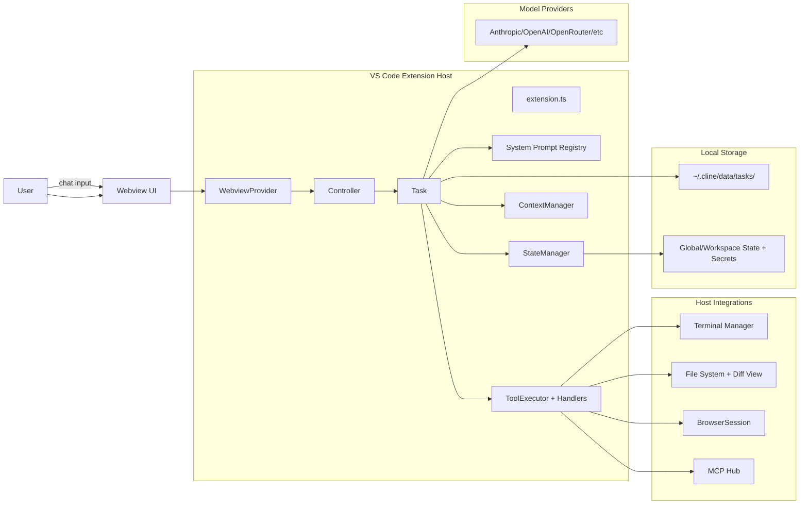

# Cline Architecture Docs (Manual)

TL;DR: This directory is a manual, per-subsystem breakdown of the Cline VS Code
extension. It focuses on the controller/task loop, tool execution with approvals,
prompt assembly, context/compaction, and disk persistence. Paths below are
relative to the `cline/` submodule.

## Start here

- Repo map: `repo-map.md`
- Core runtime (controller, task, messages): `subsystems/core-runtime.md`
- Tools + approvals: `subsystems/tools.md`
- Model selection + prompting: `subsystems/models-prompting.md`
- Context window + compaction: `subsystems/context-compaction.md`
- Persistence + history: `subsystems/persistence.md`
- Safety + failure modes: `subsystems/safety-failure-modes.md`
- Observability: `subsystems/observability.md`
- Onboarding checklist: `onboarding.md`

## System overview

