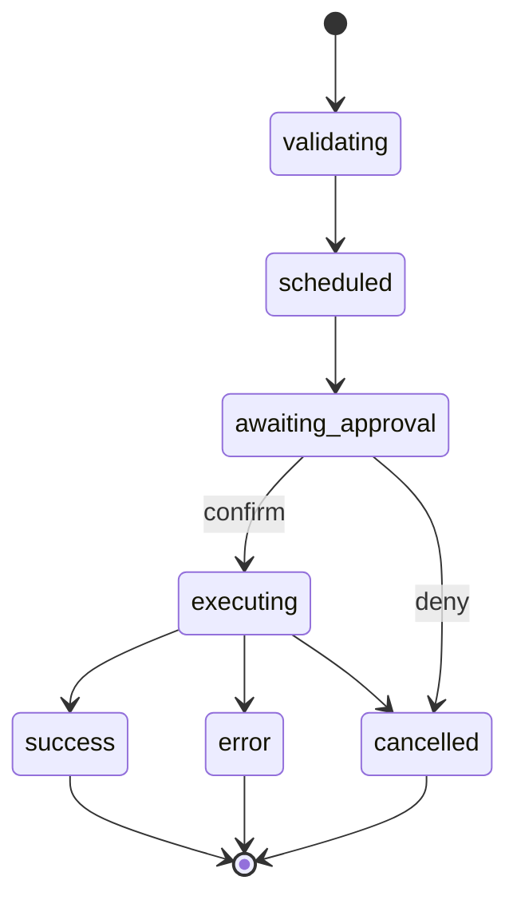

# Tools, Policy, and Confirmations

Tools are defined in Core, scheduled through a tool scheduler, and gated by a
policy engine + confirmation bus.

## Tool call mapping (state machine)

Tool call lifecycle is modeled in `gemini-cli/packages/core/src/scheduler/types.ts`
and driven by `CoreToolScheduler`.

Key components:

- Tool definitions: `gemini-cli/packages/core/src/tools/tools.ts`.
- Registry: `gemini-cli/packages/core/src/tools/tool-registry.ts`.
- Scheduler: `gemini-cli/packages/core/src/core/coreToolScheduler.ts`.
- Executor: `gemini-cli/packages/core/src/scheduler/tool-executor.ts`.
- Policy engine: `gemini-cli/packages/core/src/policy/policy-engine.ts`.
- Confirmation bus: `gemini-cli/packages/core/src/confirmation-bus/message-bus.ts`.

## How to build a new tool (summary)

1) Implement a tool by extending `BaseDeclarativeTool` and `BaseToolInvocation`.
2) Define a `FunctionDeclaration` schema for model calls.
3) Register the tool in `Config.createToolRegistry`.
4) Implement confirmation details or policy metadata.
5) Add tests in `gemini-cli/packages/core/src/tools/*.test.ts`.
