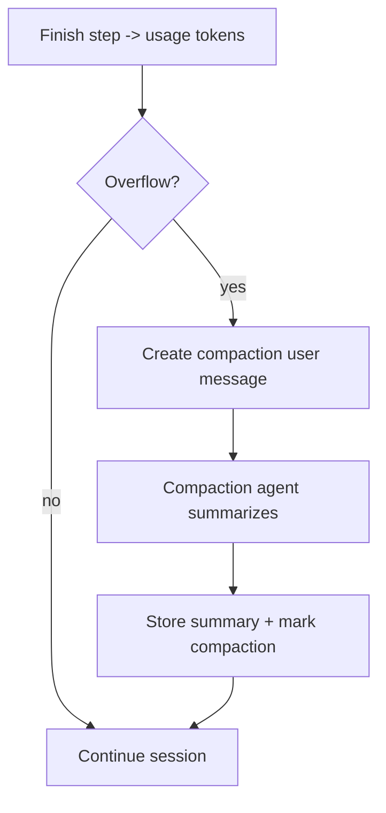

# Context Window and Compaction

OpenCode uses soft pruning for older tool outputs and a compaction pass when the
context overflows.

## Soft pruning of old tool outputs

- `SessionCompaction.prune` uses token estimates to blank older tool outputs.
- Keeps the last ~40k tokens of tool output; prunes older ones.

File:

- `packages/opencode/src/session/compaction.ts`

## Compaction (hard context compression)

- Triggered when usage exceeds model context (`SessionCompaction.isOverflow`).
- Inserts a `compaction` part, runs a compaction agent to summarize.
- Plugin hook can extend or override the compaction prompt.
- Summary stored as assistant message with `summary=true`.
- Messages filtered for compaction boundaries in `MessageV2.filterCompacted`.

Files:

- `packages/opencode/src/session/compaction.ts`
- `packages/opencode/src/session/message-v2.ts`

## Compaction flow diagram

