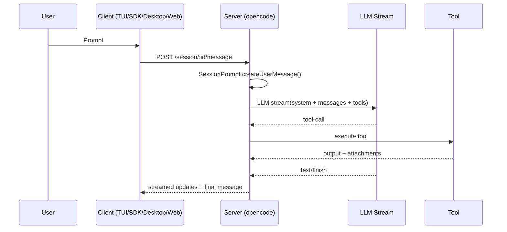

# Core Runtime (Sessions, Messages, Processor)

This subsystem covers the OpenCode session loop, message parts, and the streaming
processor that updates tool state and outputs.

## Core data model

- Session = thread with parent/child support and permissions.
  - `packages/opencode/src/session/index.ts` (Session.Info, create/fork, storage)
- MessageV2 = atomic unit in a session; each message is made of parts.
  - `packages/opencode/src/session/message-v2.ts`
- Parts are typed: `text`, `tool`, `reasoning`, `file`, `snapshot`, `patch`,
  `compaction`, `subtask`, `agent`.

Storage is local JSON under `Global.Path.data/storage`:

- `packages/opencode/src/storage/storage.ts`
- `packages/opencode/src/global/index.ts`

## Message lifecycle (high level)

1) User input becomes a `user` message with text/file/agent parts.
2) Session loop assembles prompts + tools + system instructions.
3) LLM stream emits tokens and tool calls.
4) Tool calls update tool parts (pending -> running -> completed/error).
5) Assistant message is finalized; diffs/summaries computed.

Key files:

- Prompt orchestration loop: `packages/opencode/src/session/prompt.ts`
- Stream event handling + part updates: `packages/opencode/src/session/processor.ts`
- Message to model conversion: `packages/opencode/src/session/message-v2.ts`

## Sequence: user -> tool -> response

